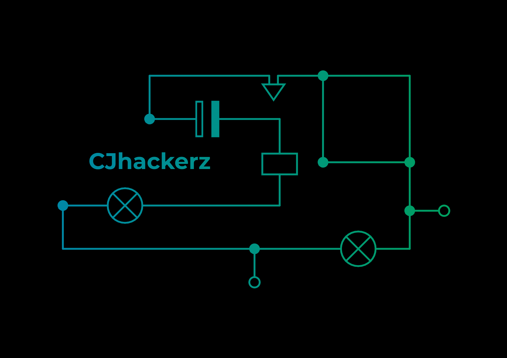

[][website]
[][twitter]
[][linkedin]
[][instagram]

 
 

### WhoAMℹ

Cybersecurity guy who loves to playaround hardware and hexadecimals. I have experince in IoT Security Research.

### My InfoSec activities and certifications 💻

I do security talks and hands on workshops for teaching penetration testing at numerous places. Active in null community for past 3 years [null is India's largest open security community.] My profile <https://null.community/profile/8808-chirag-jariwala>

💀 HackTheBox Profile 💀  

__Talks:__ 🎤

* Owasp Seasides 2019, Goa: <https://2019.owaspseasides.com/tools-showcase/day-2-28-feb-2019>

__My Certs:__ 🏆

* Offensive Security Certified Professional: [verify](https://www.youracclaim.com/users/chirag-jariwala/badges) ✅
* Judge - Global OSINT Search Party CTF: [verify](https://badgr.com/public/assertions/KMC1OCD9QdiSmqqVbVv8_w) ✅
* OSINT in the 6ix Course: [verify](https://badgr.com/public/assertions/uFaCAJnJRfCMnATKUCVgLg) ✅

### Work Experince ⚒

__SecureLayer7:__ It is pune based cybersecurity startup which provides various penetration testing service to international clients around the globe. Founded by Mr. Sandeep Kamble

* During my time there I handled IoT Security projects and carried out penetration testing
* Tested various hardware based attacks and debug ports such URAT, SPI, I2C and CAN-BUS
* Performed RF based attacks such as signal jamming and replay with Software Defined Radio (SDR) by working on USRP B210 and GNU Radio Companion
* Did firmware security assessment and reverse engineering. Extracted firmware over flash memory chips with SOIC-8, used Binwalk and frameworks like FACT for firmware filesystem analysis.
* I have good understanding of ARM assembly 32-bit and knows how to write basic exploits and shellcode.
* Wrote vulnerability reports and communicated with clients for IoT security risk mitigations.

### Programming languages and frameworks that I 💓

 
 

### Media Presence 📰

<https://www.huffingtonpost.in/entry/trace-labs-ctf-india-missing-person-cases_in_5f525849c5b6578026cd2b64>

### Spotify Playing 🎧

[website]: https://cjhackerz.net
[twitter]: https://twitter.com/cjhackerz
[instagram]: https://instagram.com/cjhackerz
[linkedin]: https://linkedin.com/in/cjhackerz